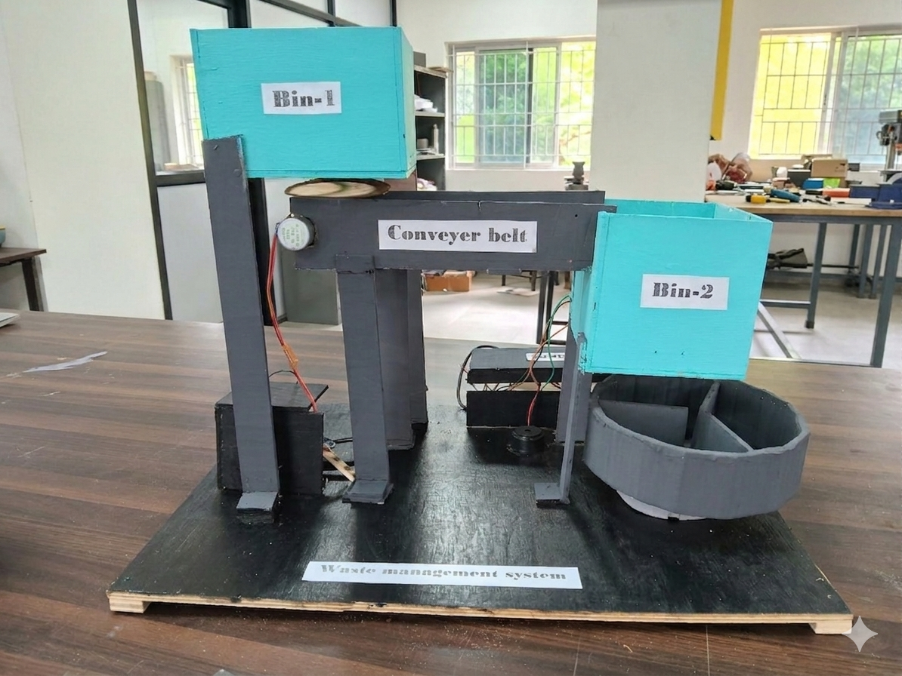

# Smart Waste Management Robot

## Overview

The Smart Waste Management Robot is an Arduino-based automated waste segregation system designed to classify waste into Metal, Wet, and Dry categories. The project utilizes multiple sensors and motor-driven mechanisms to automate the waste sorting process, reducing manual effort and promoting sustainable waste management practices.

## Features

* Automatic waste detection using IR Sensor
* Metal waste identification using Inductive Proximity Sensor
* Wet and dry waste classification using Soil Moisture Sensor
* Conveyor-based waste transportation system
* Stepper motor-controlled waste sorting mechanism
* Servo motor-operated bin opening system
* Audio alerts using a buzzer

## Components Used

* Arduino Uno
* IR Sensor
* Soil Moisture Sensor
* Inductive Proximity Sensor
* Stepper Motors
* Servo Motors
* ULN2003 Driver Board
* Buzzer
* Breadboard and Connecting Wires

## Working Principle

1. Waste is placed into the input section.
2. A conveyor mechanism transports the waste to the sensing area.
3. Sensors identify the waste type.
4. The sorting mechanism rotates toward the appropriate bin.
5. The servo motor opens the selected bin.
6. Waste is deposited automatically.

## Project View

## Project Files

* conveyor_controller.cpp
* waste_classifier.cpp
* TEPE_finalproject_documentation.pdf
* breif_about_project.pdf

## Demonstration Video

The project demonstration video is included in this repository as:

* working_video.mp4

## Team Members

* B. Deekshitha
* M. Charan
* A. Pranav
* M. Bharath Ratna
* I. Meghana
* B. Roshini

## Future Improvements

* IoT-based monitoring
* Smart fill-level detection
* Mobile application integration
* AI-powered waste recognition
* Cloud-based analytics
